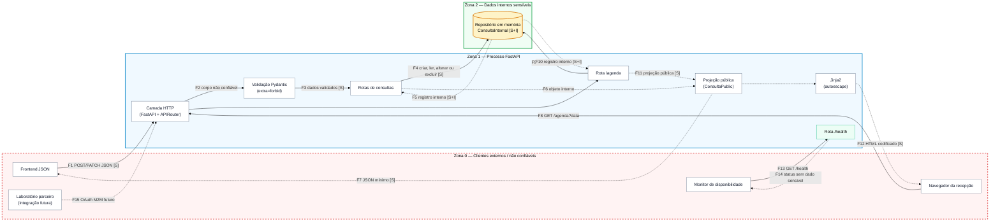

# Exercício 3

## 1. Escopo e premissas

Esta análise representa a aplicação ao final do Exercício 2. A API possui o CRUD
de consultas em JSON, a agenda HTML da recepção, modelos Pydantic, filtragem de
resposta, templates Jinja2 e persistência temporária em memória. Autenticação,
autorização, TLS, rate limiting e banco relacional ainda não fazem parte desta
versão e são registrados como lacunas, não como controles existentes.

Os campos `paciente_id`, `data_hora`, `motivo` e `observacoes`, quando associados
a uma pessoa, permitem inferir atendimento e informações de saúde. Por isso são
tratados como dados pessoais sensíveis. Essa classificação segue o artigo 5º,
inciso II, da LGPD, que inclui dados referentes à saúde na categoria de dados
pessoais sensíveis.

## 2. Inventário e classificação dos ativos

| Ativo                                      | Conteúdo                                                      | Classificação                        | Propriedade prioritária             |
| ------------------------------------------ | ------------------------------------------------------------- | ------------------------------------ | ----------------------------------- |
| Dados da consulta                          | paciente, profissional, horário, motivo, observações e status | Sensível                             | Confidencialidade                   |
| Identificadores de paciente e profissional | IDs vinculáveis a pessoas naturais                            | Pessoal/pseudonimizado, não anônimo  | Confidencialidade e integridade     |
| Metadados internos                         | `auditoria_id`, `criado_em` e `atualizado_em`                 | Interno                              | Confidencialidade e integridade     |
| Agenda da recepção                         | visão diária das consultas                                    | Sensível                             | Confidencialidade e disponibilidade |
| Contrato OpenAPI                           | endpoints, modelos e códigos HTTP                             | Interno/publicável conforme ambiente | Integridade                         |
| Código e testes                            | regras de validação e evidências de segurança                 | Interno                              | Integridade e disponibilidade       |

## 3. Avaliação pela tríade CIA

### 3.1 Confidencialidade

**Impacto: alto.** A exposição de uma consulta pode revelar que uma pessoa está
recebendo atendimento, além do motivo e das observações. O impacto envolve
privacidade, possível discriminação, dano reputacional e obrigações relacionadas
à LGPD.

Controles já implementados:

- `ConsultaPublic` enumera somente os campos autorizados para resposta.
- `response_model` filtra `auditoria_id`, `criado_em` e `atualizado_em`.
- A página HTML recebe uma projeção pública, não o objeto interno completo.
- O autoescape do Jinja2 codifica conteúdo antes da inclusão no HTML.
- `.env` e `.venv` são excluídos da entrega; `.env.example` não contém segredos.

Lacunas atuais:

- Não há autenticação, autorização por papel ou verificação de ownership.
- Não há TLS configurado na aplicação ou em proxy reverso.
- Todos os endpoints de consultas estão acessíveis a qualquer cliente de rede.
- Não há mascaramento adicional para motivo e observações conforme o papel.

Conclusão: os controles de minimização e codificação reduzem vazamentos
acidentais, mas a confidencialidade ainda não é suficiente para produção sem
controle de acesso e transporte protegido.

### 3.2 Integridade

**Impacto: alto.** Alterações indevidas podem trocar paciente, profissional,
horário ou status, causando conflitos de agenda e decisões operacionais erradas.

Controles já implementados:

- Pydantic valida tipos, IDs positivos, limites de texto e fuso horário.
- O status aceita somente `agendada`, `confirmada`, `cancelada` ou `concluida`.
- `extra="forbid"` rejeita propriedades não declaradas e reduz mass assignment.
- O repositório encapsula criação, atualização e exclusão.
- `RLock` evita alterações concorrentes inconsistentes dentro do processo.
- Testes automatizados verificam CRUD, contrato público e codificação de saída.

Lacunas atuais:

- Não existe identidade autenticada associada às alterações.
- O `auditoria_id` não equivale a um log de auditoria imutável.
- Não há transações, restrições relacionais ou persistência durável.
- Não há assinatura, hash ou outro mecanismo de detecção de adulteração.

Conclusão: a integridade sintática está parcialmente protegida, mas a integridade
de autoria e de persistência depende dos controles dos próximos exercícios.

### 3.3 Disponibilidade

**Impacto: médio-alto.** A indisponibilidade interrompe o agendamento e a visão
da recepção, podendo gerar atrasos e duplicidade de atendimentos, ainda que esta
API não seja classificada como sistema de suporte vital.

Controles já implementados:

- `/health` permite verificar se o processo responde.
- A arquitetura modular reduz o acoplamento e facilita manutenção.
- O repositório usa bloqueio para preservar o funcionamento sob concorrência
  dentro de uma única instância.
- A suíte pytest permite detectar regressões antes da execução.

Lacunas atuais:

- Reiniciar o processo apaga todas as consultas armazenadas em memória.
- Não há rate limiting, timeout, fila, redundância ou balanceamento.
- Não há backup, recuperação de desastre ou monitoramento externo.
- Uma única instância representa ponto único de falha.

Conclusão: a disponibilidade atual é adequada somente para desenvolvimento e
demonstração. Persistência durável e proteção contra abuso serão necessárias
antes de qualquer deploy de produção.

## 4. Mapeamento de frameworks para controles concretos

O OWASP é usado para riscos de aplicações e APIs; o NIST SSDF para práticas do
ciclo de desenvolvimento seguro; e o MITRE CWE como taxonomia de fraquezas. CWE
não é tratado como checklist de conformidade, mas como linguagem para relacionar
fraqueza, impacto e mitigação.

| Referência             | Risco ou prática                                  | Controle/evidência na aplicação                                                                 | Situação                                            |
| ---------------------- | ------------------------------------------------- | ----------------------------------------------------------------------------------------------- | --------------------------------------------------- |
| OWASP API3:2023        | Broken Object Property Level Authorization        | `ConsultaPublic`, `response_model` e `extra="forbid"` limitam leitura e escrita de propriedades | Implementado no nível de propriedade                |
| OWASP API1:2023        | Broken Object Level Authorization                 | Rotas usam IDs, mas ainda não verificam identidade ou ownership                                 | Lacuna crítica para o Exercício 6                   |
| OWASP API4:2023        | Unrestricted Resource Consumption                 | Não há limites de requisição                                                                    | Lacuna prevista para o Exercício 10                 |
| NIST SSDF PW.1.1       | Modelar riscos de segurança                       | Análise CIA, DFD, ativos, fluxos e trust boundaries deste relatório                             | Implementado neste exercício                        |
| NIST SSDF PW.1.2       | Rastrear requisitos, riscos e decisões de design  | Relatórios dos exercícios e registro explícito de controles e lacunas                           | Implementado e contínuo                             |
| NIST SSDF PW.4.1       | Reutilizar componentes bem protegidos             | FastAPI, Pydantic e Jinja2 com versões fixadas                                                  | Parcial; falta análise automatizada de dependências |
| NIST SSDF PW.5.1       | Produzir código conforme práticas seguras         | Validação estrita, separação modular, resposta mínima e autoescape                              | Implementado parcialmente                           |
| NIST SSDF PW.8.2       | Executar e documentar testes                      | Pytest cobre CRUD, não exposição de auditoria e tentativa de XSS                                | Implementado e expansível                           |
| NIST SSDF PW.9.1       | Definir configuração segura por padrão            | `extra="forbid"`, autoescape habilitado e `StrictUndefined`                                     | Implementado nos componentes atuais                 |
| MITRE CWE-201          | Inserção de informação sensível em dados enviados | O response model remove metadados internos antes da resposta                                    | Mitigado para os campos mapeados                    |
| MITRE CWE-915          | Modificação indevida de atributos dinâmicos       | Modelos de entrada explícitos e rejeição de campos extras                                       | Mitigado parcialmente                               |
| MITRE CWE-79 / CWE-116 | XSS e codificação incorreta de saída              | Autoescape Jinja2 e teste com `<script>` armazenado                                             | Mitigado na renderização atual                      |
| MITRE CWE-20           | Validação imprópria de entrada                    | Tipos, limites, enumeração de status, IDs positivos e fuso obrigatório                          | Mitigado para as regras existentes                  |

## 5. DFD — Diagrama de fluxo de dados

Legenda: `[S]` indica dado de paciente/consulta sensível; `[I]` indica metadado
exclusivamente interno; linha tracejada indica integração prevista, ainda não
implementada.

## 6. Trust boundaries

| Fronteira | Separação                             | Dados que atravessam                     | Riscos principais                                               | Controle atual                                                             |
| --------- | ------------------------------------- | ---------------------------------------- | --------------------------------------------------------------- | -------------------------------------------------------------------------- |
| TB-01     | Clientes externos ↔ processo FastAPI  | JSON, parâmetros, HTML e status          | interceptação, entrada maliciosa, acesso não autorizado e abuso | validação Pydantic; autenticação e TLS ainda ausentes                      |
| TB-02     | Camada HTTP/rotas ↔ repositório       | consultas e metadados internos           | leitura ou alteração indevida, perda e concorrência             | repositório encapsulado e `RLock`; sem autorização ou persistência durável |
| TB-03     | Objeto interno ↔ saída pública        | dados sensíveis e auditoria              | exposição excessiva de propriedades                             | `ConsultaPublic`, `response_model` e conversão explícita                   |
| TB-04     | Dados de usuário ↔ interpretador HTML | motivo e observações                     | XSS armazenado e comprometimento da sessão da recepção          | autoescape Jinja2 e ausência de `safe`                                     |
| TB-05     | Parceiro M2M ↔ API                    | disponibilidade de horários, futuramente | token comprometido e escopo excessivo                           | fronteira identificada; fluxo ainda não implementado                       |

TB-02 é uma fronteira lógica na versão atual: aplicação e repositório executam no
mesmo processo, mas possuem responsabilidades e níveis de exposição diferentes.
Quando houver banco relacional, ela também representará uma fronteira de processo
e credenciais.

## 7. Fluxos sensíveis e minimização

| Fluxo       | Origem → destino                | Sensibilidade | Minimização aplicada                                     |
| ----------- | ------------------------------- | ------------- | -------------------------------------------------------- |
| F1/F3/F4    | Frontend → API → repositório    | Alta          | contrato de entrada estrito e somente campos necessários |
| F5/F6/F7    | Repositório → API → frontend    | Alta          | remoção de auditoria pelo response model                 |
| F10/F11/F12 | Repositório → Jinja2 → recepção | Alta          | projeção pública, filtro por data e output encoding      |
| F13/F14     | Monitor ↔ health check          | Baixa         | resposta contém somente `status: ok`                     |
| F15         | Laboratório → API               | Alta, futura  | deverá usar identidade M2M e escopos mínimos             |

## 8. Riscos registrados para os próximos exercícios

| ID   | Risco                                            | CIA | Prioridade | Tratamento planejado                                |
| ---- | ------------------------------------------------ | --- | ---------- | --------------------------------------------------- |
| R-01 | Consulta e alteração por cliente não autenticado | C/I | Crítica    | JWT, papéis e ownership no Exercício 6              |
| R-02 | Manipulação de ID para acessar consulta alheia   | C/I | Crítica    | autorização por recurso nos Exercícios 6 e 9        |
| R-03 | Tráfego sem garantia de TLS                      | C/I | Alta       | requisito de infraestrutura e HSTS no Exercício 10  |
| R-04 | Perda total dos dados ao reiniciar               | I/A | Alta       | SQLModel e banco relacional no Exercício 11         |
| R-05 | Exaustão de recursos por requisições repetidas   | A   | Alta       | rate limiting no Exercício 10                       |
| R-06 | Ausência de log de auditoria imutável            | I   | Média      | persistência e logging seguro em evolução posterior |
