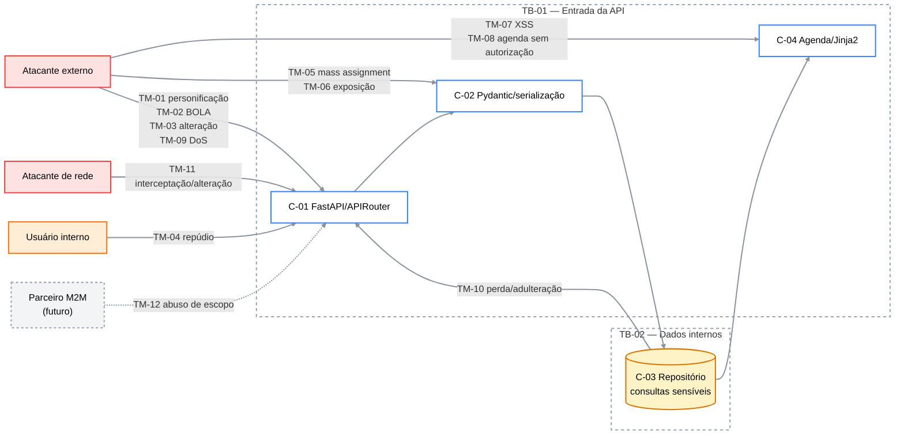

# Exercício 4

## 1. Objetivo, escopo e método

Este threat model parte do DFD e das trust boundaries documentadas no Exercício 3. O escopo atual inclui a API FastAPI, os modelos Pydantic, as rotas JSON, a
agenda Jinja2 e o repositório em memória. Autenticação humana, integração M2M,
rate limiting e persistência SQL ainda não estão implementados; suas ameaças são
incluídas porque fazem parte do sistema-alvo e precisam orientar os próximos
exercícios.

O método aplicado segue quatro etapas: decompor o sistema, identificar ameaças
com STRIDE, definir respostas e verificar se cada ameaça possui mitigação
acionável e testável.

| Categoria                  | Significado                                           | Propriedade violada   |
| -------------------------- | ----------------------------------------------------- | --------------------- |
| S — Spoofing               | Fingir ser outro usuário, serviço ou componente       | Autenticação          |
| T — Tampering              | Alterar dados, mensagens ou código sem autorização    | Integridade           |
| R — Repudiation            | Negar uma ação sem que existam evidências suficientes | Não repúdio/auditoria |
| I — Information Disclosure | Expor informação a quem não deveria acessá-la         | Confidencialidade     |
| D — Denial of Service      | Impedir ou degradar o uso legítimo do serviço         | Disponibilidade       |
| E — Elevation of Privilege | Obter capacidades acima das autorizadas               | Autorização           |

## 2. Atores e agentes de ameaça

| Ator                      | Intenção legítima ou maliciosa                       | Nível de confiança atual                      |
| ------------------------- | ---------------------------------------------------- | --------------------------------------------- |
| Frontend da clínica       | Consumir o CRUD em JSON                              | Externo e não autenticado nesta versão        |
| Recepcionista             | Consultar a agenda diária                            | Externo e não autenticado nesta versão        |
| Profissional de saúde     | Gerenciar consultas próprias                         | Papel planejado, ainda sem identidade técnica |
| Administrador             | Administrar recursos sensíveis                       | Papel planejado, exige MFA futuramente        |
| Laboratório parceiro      | Consultar disponibilidade por M2M                    | Integração futura e não confiável por padrão  |
| Atacante externo          | Enumerar, alterar, extrair ou indisponibilizar dados | Hostil                                        |
| Usuário interno malicioso | Abusar de acesso legítimo ou negar ações             | Parcialmente confiável                        |
| Atacante de rede          | Interceptar ou modificar tráfego                     | Hostil                                        |

## 3. Ativos protegidos

| ID   | Ativo                                      | Impacto se comprometido                                      | CIA prioritária |
| ---- | ------------------------------------------ | ------------------------------------------------------------ | --------------- |
| A-01 | Dados de saúde e identificação do paciente | Violação de privacidade, discriminação e impacto regulatório | C               |
| A-02 | Horário, profissional e status da consulta | Conflitos de agenda e atendimento incorreto                  | I/A             |
| A-03 | Evidências de autoria e auditoria          | Impossibilidade de investigar alterações                     | I/R             |
| A-04 | Credenciais, JWT e fatores MFA futuros     | Personificação e acesso amplo                                | C/I             |
| A-05 | Disponibilidade da API e da agenda         | Interrupção do agendamento e da recepção                     | A               |
| A-06 | Metadados internos e configuração          | Reconhecimento e apoio a ataques posteriores                 | C/I             |
| A-07 | Token e escopos do laboratório futuro      | Acesso M2M além do contrato                                  | C/I             |
| A-08 | Código, dependências e contratos OpenAPI   | Introdução de vulnerabilidades e regressões                  | I               |

## 4. Superfícies de ataque

| ID    | Superfície                         | Entradas ou operações                            | Trust boundary | Ameaças relacionadas       |
| ----- | ---------------------------------- | ------------------------------------------------ | -------------- | -------------------------- |
| AS-01 | `POST/GET /consultas`              | JSON e listagem completa                         | TB-01          | TM-01, TM-05, TM-06, TM-09 |
| AS-02 | `GET/PATCH/DELETE /consultas/{id}` | ID controlado pelo cliente e alteração de estado | TB-01/TB-02    | TM-02, TM-03, TM-04        |
| AS-03 | `GET /agenda?data=`                | Data de filtro e conteúdo armazenado             | TB-01/TB-04    | TM-07, TM-08, TM-09        |
| AS-04 | Pydantic e serialização            | Corpo JSON, tipos, campos e respostas            | TB-03          | TM-05, TM-06, TM-09        |
| AS-05 | Repositório em memória             | Leitura e mutação de registros internos          | TB-02          | TM-03, TM-04, TM-10        |
| AS-06 | `/docs` e `/openapi.json`          | Inventário de endpoints e schemas                | TB-01          | TM-06, TM-09               |
| AS-07 | `/health`                          | Sondagem repetida e estado do processo           | TB-01          | TM-09                      |
| AS-08 | Transporte HTTP                    | Requisições e respostas em trânsito              | TB-01          | TM-01, TM-11               |
| AS-09 | OAuth M2M futuro                   | Token do parceiro, claims e escopos              | TB-05          | TM-01, TM-12               |

## 5. Misuse cases

### MC-01 — Enumeração de consultas de outros pacientes

| Campo                  | Descrição                                                          |
| ---------------------- | ------------------------------------------------------------------ |
| Ator                   | Atacante externo ou usuário autenticado sem vínculo com o paciente |
| Pré-condição           | Endpoint aceita identificador previsível e não valida ownership    |
| Ação maliciosa         | Alterar sequencialmente `{id}` em `GET /consultas/{id}`            |
| Resultado indesejado   | Leitura de motivo, horário e observações de terceiros              |
| Ativos/ameaças         | A-01, A-02; TM-02; STRIDE I/E                                      |
| Requisito de segurança | Autorizar cada acesso por papel, recurso e relacionamento          |
| Teste futuro           | Usuário A deve receber `403` ao consultar registro do usuário B    |

### MC-02 — Alteração ou exclusão de consulta sem autorização

| Campo                  | Descrição                                                              |
| ---------------------- | ---------------------------------------------------------------------- |
| Ator                   | Cliente anônimo ou usuário sem permissão                               |
| Pré-condição           | `PATCH` e `DELETE` não exigem identidade nem ownership                 |
| Ação maliciosa         | Confirmar, cancelar, trocar horário ou excluir consulta alheia         |
| Resultado indesejado   | Fraude operacional, conflito de agenda ou perda do atendimento         |
| Ativos/ameaças         | A-02, A-03; TM-03, TM-04; STRIDE T/R/E                                 |
| Requisito de segurança | Autenticação, autorização por recurso e trilha de auditoria            |
| Teste futuro           | Operação não autorizada deve retornar `401` ou `403` sem alterar dados |

### MC-03 — XSS armazenado contra a recepção

| Campo                | Descrição                                                                  |
| -------------------- | -------------------------------------------------------------------------- |
| Ator                 | Cliente capaz de cadastrar conteúdo em motivo ou observações               |
| Pré-condição         | Conteúdo persistido é renderizado na agenda HTML                           |
| Ação maliciosa       | Salvar `<script>` ou HTML com manipulador de evento                        |
| Resultado indesejado | Execução no navegador da recepção, roubo de sessão ou ação em seu nome     |
| Ativos/ameaças       | A-01, A-04; TM-07; STRIDE T/I/E                                            |
| Controle atual       | Jinja2 com autoescape e teste que rejeita tag executável                   |
| Risco residual       | Regressão caso seja introduzido `safe`, HTML manual ou contexto inadequado |

### MC-04 — Mass assignment de propriedade interna

| Campo                | Descrição                                                          |
| -------------------- | ------------------------------------------------------------------ |
| Ator                 | Cliente da API                                                     |
| Pré-condição         | Vinculação automática ou schema permissivo                         |
| Ação maliciosa       | Enviar `auditoria_id`, papel, owner ou outro campo interno no JSON |
| Resultado indesejado | Alteração de atributos que o cliente não deveria controlar         |
| Ativos/ameaças       | A-03, A-06; TM-05; STRIDE T/E                                      |
| Controle atual       | Modelos explícitos e `extra="forbid"`                              |
| Teste atual          | Campo não declarado deve produzir `422`                            |

### MC-05 — Exaustão de recursos

| Campo                  | Descrição                                                                 |
| ---------------------- | ------------------------------------------------------------------------- |
| Ator                   | Bot ou cliente automatizado                                               |
| Pré-condição           | Ausência de rate limiting, limite global de corpo e quota                 |
| Ação maliciosa         | Repetir listagens, criações ou renderizações da agenda em alta frequência |
| Resultado indesejado   | CPU e memória esgotadas, latência ou indisponibilidade                    |
| Ativos/ameaças         | A-05; TM-09; STRIDE D                                                     |
| Requisito de segurança | Limites por rota e cliente, tamanho de corpo, timeouts e monitoramento    |
| Teste futuro           | Exceder a cota deve retornar `429` sem degradar as demais rotas           |

### MC-06 — Negação de autoria de uma alteração

| Campo                  | Descrição                                                                           |
| ---------------------- | ----------------------------------------------------------------------------------- |
| Ator                   | Usuário interno legítimo ou conta comprometida                                      |
| Pré-condição           | Ausência de identidade e log de auditoria imutável                                  |
| Ação maliciosa         | Alterar uma consulta e posteriormente negar a operação                              |
| Resultado indesejado   | Investigação inconclusiva e responsabilização impossível                            |
| Ativos/ameaças         | A-03; TM-04; STRIDE R                                                               |
| Requisito de segurança | Registrar ator, ação, recurso, data, resultado e identificador da requisição        |
| Teste futuro           | Alteração deve gerar evento correlacionável sem armazenar segredo ou dado excessivo |

### MC-07 — Interceptação ou alteração do tráfego

| Campo                  | Descrição                                                                        |
| ---------------------- | -------------------------------------------------------------------------------- |
| Ator                   | Atacante na rede                                                                 |
| Pré-condição           | Uso de HTTP sem terminação TLS confiável                                         |
| Ação maliciosa         | Capturar ou modificar requisições e respostas de consultas                       |
| Resultado indesejado   | Vazamento de dados de saúde ou mudança do conteúdo em trânsito                   |
| Ativos/ameaças         | A-01, A-02, A-04; TM-11; STRIDE T/I                                              |
| Requisito de segurança | HTTPS obrigatório, HSTS no ambiente publicado e cookies seguros quando aplicável |
| Teste futuro           | HTTP deve redirecionar ou ser recusado; HTTPS deve apresentar certificado válido |

### MC-08 — Abuso do token do laboratório

| Campo                  | Descrição                                                                          |
| ---------------------- | ---------------------------------------------------------------------------------- |
| Ator                   | Parceiro comprometido ou atacante com token roubado                                |
| Pré-condição           | Token M2M sem audiência, expiração ou escopo mínimo                                |
| Ação maliciosa         | Usar a integração para acessar pacientes ou modificar consultas                    |
| Resultado indesejado   | Escalada de privilégio e exposição além do contrato                                |
| Ativos/ameaças         | A-01, A-07; TM-12; STRIDE S/I/E                                                    |
| Requisito de segurança | Client Credentials, audiência, expiração curta e escopo somente de disponibilidade |
| Teste futuro           | Token M2M deve receber `403` em endpoints fora do escopo permitido                 |

## 6. Aplicação de STRIDE aos componentes

Esta matriz aplica as seis categorias a cinco componentes, superando o mínimo de
três componentes exigido. O símbolo `—` indica que não foi identificada ameaça
direta relevante naquele componente; não significa ausência de risco no sistema.

| Componente                     | S     | T     | R     | I            | D     | E     |
| ------------------------------ | ----- | ----- | ----- | ------------ | ----- | ----- |
| C-01 FastAPI/APIRouter         | TM-01 | TM-03 | TM-04 | TM-02        | TM-09 | TM-12 |
| C-02 Pydantic/serialização     | —     | TM-05 | TM-04 | TM-06        | TM-09 | TM-05 |
| C-03 Repositório em memória    | TM-01 | TM-10 | TM-04 | TM-06        | TM-10 | TM-12 |
| C-04 Agenda/Jinja2             | TM-08 | TM-07 | TM-04 | TM-07, TM-08 | TM-09 | TM-07 |
| C-05 Transporte/infraestrutura | TM-01 | TM-11 | TM-04 | TM-11        | TM-09 | TM-12 |

### C-01 — FastAPI e APIRouter

- **S:** requisições são anônimas; futuramente, tokens roubados poderão permitir
  personificação.
- **T:** `PATCH` e `DELETE` permitem mutação sem autorização.
- **R:** não existe vínculo entre alteração e identidade verificável.
- **I:** IDs previsíveis permitem buscar consultas de terceiros.
- **D:** qualquer cliente pode repetir operações sem limite.
- **E:** papéis administrativos e escopos M2M precisarão ser verificados em cada
  função protegida.

### C-02 — Pydantic e serialização

- **T/E:** campos adicionais poderiam alterar propriedades internas; atualmente
  são bloqueados por modelos explícitos e `extra="forbid"`.
- **R:** tentativas rejeitadas ainda não geram evento de segurança correlacionado.
- **I:** esquecer `response_model` em uma nova rota pode reintroduzir exposição.
- **D:** limites de texto existem, mas não há limite global de corpo HTTP.

### C-03 — Repositório em memória

- **S:** o repositório não recebe identidade autenticada do ator.
- **T:** não existem constraints relacionais, transações ou verificação de
  ownership antes da mutação.
- **R:** `auditoria_id` identifica o registro, mas não registra quem fez a ação.
- **I:** o modelo interno contém campos que não podem atravessar TB-03.
- **D:** reinício apaga todos os registros e crescimento contínuo consome memória.
- **E:** não há isolamento por usuário, clínica ou profissional.

### C-04 — Agenda e Jinja2

- **S/I:** a página interna pode ser acessada sem identidade de recepcionista.
- **T/I/E:** conteúdo armazenado poderia executar no navegador se o autoescape
  fosse contornado; o controle atual neutraliza o payload testado.
- **R:** visualizações e tentativas maliciosas não são auditadas.
- **D:** agendas grandes podem aumentar custo de busca e renderização.

### C-05 — Transporte e infraestrutura

- **S:** o servidor ainda não autentica clientes ou parceiros.
- **T/I:** sem HTTPS obrigatório, tráfego pode ser alterado ou lido em trânsito.
- **R:** logs de acesso não substituem auditoria de negócio.
- **D:** não há rate limiting, redundância, timeouts definidos ou proteção DDoS.
- **E:** a infraestrutura ainda não restringe funções por identidade ou escopo.

## 7. Visão consolidada das ameaças

## 8. Registro consolidado e respostas

| ID    | STRIDE | Cenário                                            | Ativo/superfície       | Controle atual                                  | Mitigação necessária                                                         | Prioridade/status                     |
| ----- | ------ | -------------------------------------------------- | ---------------------- | ----------------------------------------------- | ---------------------------------------------------------------------------- | ------------------------------------- |
| TM-01 | S      | Cliente anônimo ou token roubado assume identidade | A-04; AS-01/02/03/09   | Nenhum controle de identidade                   | OAuth2, bcrypt, JWT curto, MFA administrativo e validação de cliente         | Crítica — aberta                      |
| TM-02 | I/E    | Enumeração de ID expõe consulta de terceiro        | A-01; AS-02            | Response model limita propriedades, não objetos | Ownership centralizado e teste BOLA                                          | Crítica — aberta                      |
| TM-03 | T/E    | Alteração ou exclusão não autorizada               | A-02; AS-02/05         | Validação sintática                             | Autenticação, autorização por recurso e transação                            | Crítica — aberta                      |
| TM-04 | R      | Autor nega alteração sem prova suficiente          | A-03; AS-02/05         | `auditoria_id` por registro                     | Log imutável e correlacionado à identidade e requisição                      | Alta — aberta                         |
| TM-05 | T/E    | Cliente envia atributo interno                     | A-03/A-06; AS-01/04    | `extra="forbid"` e schemas explícitos           | Manter testes negativos em todos os modelos                                  | Média — mitigada, monitorar regressão |
| TM-06 | I      | Nova rota retorna modelo interno completo          | A-01/A-06; AS-01/04/06 | `response_model` nas rotas atuais               | Auditoria OpenAPI e teste do conjunto exato de campos                        | Alta — parcialmente mitigada          |
| TM-07 | T/I/E  | XSS armazenado executa na recepção                 | A-01/A-04; AS-03       | Autoescape e teste com `<script>`               | Manter ausência de `safe`, adicionar CSP e ampliar payloads                  | Alta — parcialmente mitigada          |
| TM-08 | I/S    | Agenda interna acessada sem papel de recepção      | A-01; AS-03            | Projeção pública remove auditoria               | Autenticação e RBAC para a página                                            | Crítica — aberta                      |
| TM-09 | D      | Requisições repetidas ou grandes esgotam recursos  | A-05; AS-01/03/06/07   | Limites de alguns campos                        | Rate limiting diferenciado, tamanho de corpo, timeout e monitoramento        | Alta — aberta                         |
| TM-10 | T/D    | Falha ou reinício causa perda e inconsistência     | A-02/A-05; AS-05       | `RLock` no processo                             | SQLModel, constraints, transações, backup e recuperação                      | Alta — aberta                         |
| TM-11 | T/I    | Tráfego é lido ou alterado em trânsito             | A-01/A-02/A-04; AS-08  | Nenhum controle de transporte no projeto        | HTTPS no proxy/servidor e HSTS                                               | Crítica — aberta                      |
| TM-12 | S/I/E  | Papel ou escopo M2M permite operação excessiva     | A-01/A-07; AS-09       | Integração ainda não existe                     | RBAC, autorização por recurso, Client Credentials, audience e scopes mínimos | Crítica — planejada                   |

## 9. Plano de mitigação rastreável

| Mitigação                                 | Ameaças                    | Entrega prevista            | Evidência de aceitação                                   |
| ----------------------------------------- | -------------------------- | --------------------------- | -------------------------------------------------------- |
| M-01 OAuth2, bcrypt, JWT e MFA            | TM-01, TM-08, TM-12        | Exercício 6                 | testes `401`, expiração e MFA administrativo             |
| M-02 RBAC e ownership centralizado        | TM-02, TM-03, TM-08, TM-12 | Exercícios 6 e 9            | usuário não acessa nem altera recurso alheio             |
| M-03 Escopos M2M mínimos                  | TM-01, TM-12               | Exercício 7                 | token do laboratório limitado à disponibilidade          |
| M-04 Modelos estritos e resposta mínima   | TM-05, TM-06               | Exercícios 2 e 9            | campos extras `422`; auditoria ausente da resposta       |
| M-05 Autoescape, encoding e CSP           | TM-07                      | Exercícios 2, 9 e 10        | payloads XSS não executam e header CSP é verificado      |
| M-06 Auditoria correlacionada             | TM-04                      | Capstone                    | evento registra ator, ação, recurso, horário e resultado |
| M-07 Rate limiting e limites operacionais | TM-09                      | Exercício 10                | excesso retorna `429`; login tem limite mais restrito    |
| M-08 SQLModel, transações e persistência  | TM-03, TM-10               | Exercício 11                | reinício preserva registros; queries são parametrizadas  |
| M-09 HTTPS e HSTS                         | TM-11                      | Exercício 10/infraestrutura | HTTP indisponível ou redirecionado; HSTS presente        |
| M-10 Testes, pipeline e auditoria OpenAPI | Todas                      | Exercícios 12 e 13          | suíte ligada aos IDs TM e security gate executado        |

## 10. Relação com riscos do Exercício 3

| Risco anterior                 | Ameaças detalhadas neste modelo |
| ------------------------------ | ------------------------------- |
| R-01 — cliente não autenticado | TM-01, TM-03, TM-08             |
| R-02 — manipulação de ID       | TM-02, TM-03                    |
| R-03 — ausência de TLS         | TM-11                           |
| R-04 — perda ao reiniciar      | TM-10                           |
| R-05 — exaustão de recursos    | TM-09                           |
| R-06 — auditoria insuficiente  | TM-04                           |
