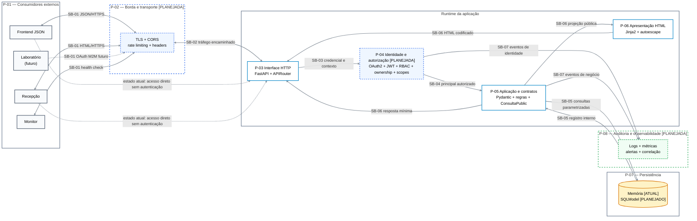

# Exercício 5

## 1. Objetivo e escopo

Este documento complementa o DFD do Exercício 3 e o threat model STRIDE do
Exercício 4 com uma visão formal das partições arquiteturais. O objetivo é
identificar onde muda o nível de confiança, quais dados atravessam cada fronteira
e quais vetores pertencem aos eixos de design, implementação e infraestrutura.

A arquitetura distingue o estado atual do estado-alvo. Componentes marcados como
planejados ainda não são controles ativos; eles representam decisões necessárias
para os próximos exercícios.

## 2. Partições do sistema

| ID   | Partição                    | Componentes                                             | Responsabilidade                                                         | Estado                                                  |
| ---- | --------------------------- | ------------------------------------------------------- | ------------------------------------------------------------------------ | ------------------------------------------------------- |
| P-01 | Consumidores externos       | Frontend, navegador da recepção, laboratório e monitor  | Iniciar requisições humanas, M2M e de disponibilidade                    | Frontend, recepção e monitor atuais; laboratório futuro |
| P-02 | Borda e transporte          | Proxy reverso ou API gateway, TLS, CORS e rate limiting | Encerrar HTTPS, restringir origens, aplicar limites e encaminhar tráfego | Planejada                                               |
| P-03 | Interface HTTP              | FastAPI, APIRouter, OpenAPI e `/health`                 | Resolver rotas, métodos, parâmetros e respostas HTTP                     | Implementada                                            |
| P-04 | Identidade e autorização    | OAuth2, JWT, MFA, RBAC, ownership e scopes              | Autenticar o ator e autorizar função, recurso e escopo                   | Planejada para Exercícios 6 e 7                         |
| P-05 | Aplicação e contratos       | Pydantic, regras de consulta, `ConsultaPublic` e CRUD   | Validar entrada, aplicar regras e minimizar a saída                      | Parcialmente implementada                               |
| P-06 | Apresentação HTML           | Rota `/agenda`, Jinja2 e templates                      | Projetar dados públicos e codificar a saída HTML                         | Implementada                                            |
| P-07 | Persistência                | Repositório em memória; SQLModel futuro                 | Armazenar e consultar dados e metadados internos                         | Memória atual; banco planejado                          |
| P-08 | Auditoria e observabilidade | Logs de segurança, métricas, alertas e correlação       | Detectar abuso, sustentar não repúdio e operação                         | Planejada                                               |

## 3. Diagrama arquitetural com partições e fronteiras

Legenda: linha contínua representa o fluxo-alvo; linha tracejada representa o
estado atual inseguro ou uma integração futura.

## 4. Fronteiras de segurança

| ID    | Fronteira                   | Mudança de confiança                             | Dados                                         | Política necessária                                               | Estado atual              |
| ----- | --------------------------- | ------------------------------------------------ | --------------------------------------------- | ----------------------------------------------------------------- | ------------------------- |
| SB-01 | Cliente externo → borda     | Internet não confiável para perímetro controlado | JSON, HTML, tokens e parâmetros               | HTTPS, allowlist CORS, limites, validação de host e headers       | Borda não implementada    |
| SB-02 | Borda → runtime FastAPI     | Proxy confiável para processo da aplicação       | Requisição encaminhada e identidade de origem | Proxy confiável, normalização HTTP e restrição de acesso direto   | Não implementada          |
| SB-03 | Interface HTTP → identidade | Requisição anônima para principal autenticado    | Credenciais, JWT e claims                     | Verificação de assinatura, expiração, issuer, audience e MFA      | Não implementada          |
| SB-04 | Identidade → aplicação      | Principal autenticado para operação autorizada   | Papel, subject, ownership e scopes            | RBAC mais autorização por recurso e menor privilégio              | Não implementada          |
| SB-05 | Aplicação → persistência    | Regra de negócio para dados internos             | Consulta sensível e auditoria                 | Queries parametrizadas, transação, constraint e credencial mínima | Repositório em memória    |
| SB-06 | Modelo interno → saída      | Dados internos para consumidor externo           | Consulta, auditoria e HTML                    | `response_model`, projeção pública e output encoding              | Parcialmente implementada |
| SB-07 | Aplicação → observabilidade | Evento de negócio para registro operacional      | Ator, ação, recurso, resultado e contexto     | Redação de dados sensíveis, integridade e acesso restrito ao log  | Não implementada          |

## 5. Fluxos entre as partições

| Fluxo | Origem → destino          | Conteúdo                                  | Validações/controles                     | Risco se a fronteira falhar                      |
| ----- | ------------------------- | ----------------------------------------- | ---------------------------------------- | ------------------------------------------------ |
| AF-01 | Frontend → P-02 → P-03    | JSON de consulta                          | HTTPS, CORS e método permitido           | interceptação, origem indevida ou verb tampering |
| AF-02 | P-03 → P-04               | JWT ou credencial futura                  | assinatura, expiração, issuer e audience | spoofing ou sessão inválida aceita               |
| AF-03 | P-04 → P-05               | principal, papel e atributos              | RBAC, ownership e scopes                 | BOLA, BFLA ou escalada de privilégio             |
| AF-04 | P-05 → P-07               | criação, leitura, atualização ou exclusão | schema estrito e query parametrizada     | injeção, alteração indevida ou inconsistência    |
| AF-05 | P-07 → P-05               | modelo interno com auditoria              | acesso mínimo e transação                | exposição ou adulteração de dado sensível        |
| AF-06 | P-05 → frontend           | `ConsultaPublic` em JSON                  | `response_model`                         | exposição excessiva de propriedades              |
| AF-07 | Recepção → P-02/P-03/P-04 | pedido da agenda e identidade humana      | HTTPS e papel `recepcionista`            | acesso interno por ator não autorizado           |
| AF-08 | P-05 → P-06 → recepção    | projeção pública e HTML                   | autoescape e headers do navegador        | XSS armazenado e vazamento de agenda             |
| AF-09 | Laboratório → P-02/P-04   | token Client Credentials futuro           | audience, expiração e scope mínimo       | abuso do parceiro ou token roubado               |
| AF-10 | P-04/P-05 → P-08          | eventos de segurança e negócio            | correlação e redação                     | repúdio ou vazamento por logs                    |
| AF-11 | Monitor → P-02/P-03       | `GET /health`                             | limite e resposta mínima                 | enumeração ou consumo abusivo                    |

## 6. Três eixos de segurança de APIs

Os três eixos são complementares. Uma API pode ter código sem injeção e ainda
ser insegura por uma decisão de autorização incorreta ou por exposição de rede
mal configurada.

### 6.1 Eixo de design

| ID    | Vetor                                                  | Partição/fronteira | Impacto                                               | Controle ou decisão arquitetural                              | Relação com o threat model |
| ----- | ------------------------------------------------------ | ------------------ | ----------------------------------------------------- | ------------------------------------------------------------- | -------------------------- |
| VD-01 | BOLA por manipulação de `{id}`                         | P-04/P-05; SB-04   | Consulta de outro paciente lida ou alterada           | Autorização por recurso e ownership em dependência central    | TM-02, TM-03               |
| VD-02 | BFLA entre recepcionista, profissional e administrador | P-04; SB-04        | Função administrativa executada por papel inferior    | RBAC com permissões explícitas e deny by default              | TM-12                      |
| VD-03 | Autenticação inadequada ou sessão longa                | P-04; SB-03        | Personificação e acesso persistente                   | JWT assinado, curto, com issuer/audience e MFA administrativo | TM-01                      |
| VD-04 | Escopos M2M excessivos                                 | P-04; SB-03/SB-04  | Laboratório acessa pacientes ou altera consultas      | Client Credentials e scope somente de disponibilidade         | TM-12                      |
| VD-05 | Exposição excessiva de propriedades                    | P-05; SB-06        | Vazamento de auditoria ou futuro campo sensível       | Contratos distintos de entrada, persistência e resposta       | TM-06                      |
| VD-06 | Estados de consulta manipulados fora do fluxo          | P-05               | Cancelar concluída ou concluir cancelada              | Máquina de estados e validação de transições no servidor      | TM-03                      |
| VD-07 | Falta de minimização por finalidade e papel            | P-04/P-05/P-06     | Recepção ou parceiro recebe dados além do necessário  | Schemas de resposta por consumidor e menor privilégio         | TM-02, TM-08, TM-12        |
| VD-08 | Ausência de estratégia de auditoria                    | P-08; SB-07        | Usuário nega alteração e incidente não é investigável | Evento estruturado com ator, ação, recurso e resultado        | TM-04                      |

### 6.2 Eixo de implementação

| ID    | Vetor                              | Partição/fronteira | Impacto                                                      | Controle atual ou necessário                                      | Relação com o threat model |
| ----- | ---------------------------------- | ------------------ | ------------------------------------------------------------ | ----------------------------------------------------------------- | -------------------------- |
| VI-01 | Mass assignment                    | P-05; SB-06        | Cliente altera atributo interno                              | `extra="forbid"` e modelos explícitos já implementados            | TM-05                      |
| VI-02 | Validação insuficiente de entrada  | P-03/P-05          | Payload inesperado ou regra de negócio burlada               | Tipos, limites, whitelist, regex e validação cruzada              | TM-03, TM-05               |
| VI-03 | XSS armazenado                     | P-06; SB-06        | Código executado no navegador da recepção                    | Autoescape atual, ausência de `safe`, CSP futura e testes         | TM-07                      |
| VI-04 | Serialização insegura              | P-05; SB-06        | Objeto interno devolvido integralmente                       | `response_model` atual e auditoria automática do OpenAPI          | TM-06                      |
| VI-05 | SQL injection após migração        | P-05/P-07; SB-05   | Leitura ou alteração arbitrária do banco                     | SQLModel e queries sempre parametrizadas                          | TM-03, TM-10               |
| VI-06 | Validação JWT incompleta           | P-04; SB-03        | Token expirado, algoritmo indevido ou audience errada aceita | Algoritmo fixo, assinatura, `exp`, `iss`, `aud` e tipo de cliente | TM-01, TM-12               |
| VI-07 | Exceção ou log com dado sensível   | P-03/P-08; SB-07   | Vazamento de stack trace, token ou informação clínica        | Erro genérico e redação de logs                                   | TM-04, TM-06               |
| VI-08 | Concorrência e atualização perdida | P-05/P-07; SB-05   | Agenda inconsistente                                         | Transação, constraint e controle de concorrência                  | TM-10                      |

### 6.3 Eixo de infraestrutura

| ID    | Vetor                                             | Partição/fronteira | Impacto                                        | Controle necessário                                       | Relação com o threat model |
| ----- | ------------------------------------------------- | ------------------ | ---------------------------------------------- | --------------------------------------------------------- | -------------------------- |
| VF-01 | HTTP sem TLS obrigatório                          | P-02; SB-01/SB-02  | Leitura e alteração do tráfego                 | HTTPS e HSTS                                              | TM-11                      |
| VF-02 | CORS permissivo                                   | P-02; SB-01        | Site não autorizado chama a API pelo navegador | Allowlist explícita de origens, métodos e headers         | TM-08                      |
| VF-03 | Ausência de headers de segurança                  | P-02/P-06          | Clickjacking e MIME sniffing                   | HSTS, X-Frame-Options e X-Content-Type-Options            | TM-07, TM-11               |
| VF-04 | Falta de rate limiting e quotas                   | P-02; SB-01        | DoS, força bruta e custo operacional           | Limite geral e política mais restrita no login            | TM-09                      |
| VF-05 | Exposição pública de OpenAPI e endpoints internos | P-02/P-03          | Reconhecimento e inventário do alvo            | Restringir documentação por ambiente e rede               | TM-06                      |
| VF-06 | Versões antigas ou dependências vulneráveis       | P-03/P-06/P-07     | Exploração de falha conhecida                  | Inventário, versões fixadas, SCA e atualização controlada | TM-06, TM-10               |
| VF-07 | Instância única e dados somente em memória        | P-07               | Perda de dados e indisponibilidade             | Banco durável, backup, recuperação e redundância          | TM-10                      |
| VF-08 | Acesso direto ao runtime contorna a borda         | P-02/P-03; SB-02   | CORS, TLS ou rate limit ignorados              | Rede privada, firewall e confiança explícita no proxy     | TM-09, TM-11               |
| VF-09 | Logs e métricas sem proteção                      | P-08; SB-07        | Vazamento de dados e destruição de evidência   | Armazenamento restrito, retenção e integridade            | TM-04, TM-06               |

## 7. Matriz consolidada por eixo

| Eixo           | Pergunta de segurança                                            | Exemplos prioritários                                         | Camada principal de tratamento            |
| -------------- | ---------------------------------------------------------------- | ------------------------------------------------------------- | ----------------------------------------- |
| Design         | A operação deveria existir para este ator, recurso e finalidade? | BOLA, BFLA, sessão, scopes, estados e minimização             | Modelo de autorização e regras de negócio |
| Implementação  | O comportamento projetado foi codificado de forma resistente?    | validação, XSS, serialização, SQLi, JWT, erros e concorrência | Código, frameworks e testes               |
| Infraestrutura | O ambiente preserva as garantias da aplicação?                   | TLS, CORS, headers, rate limit, inventário, backup e logs     | Proxy, rede, plataforma e pipeline        |

Uma mitigação pode atravessar eixos. Por exemplo, definir ownership é decisão de
design, aplicá-lo em uma dependência é implementação e impedir acesso direto ao
runtime é infraestrutura.

## 8. Decisões para a autenticação dos próximos exercícios

1. Identidade será centralizada em uma dependência de autenticação, sem lógica
   duplicada entre routers.
2. Clientes humanos usarão OAuth2PasswordBearer com JWT de curta duração.
3. Administradores exigirão MFA simulado antes da emissão de sessão privilegiada.
4. Autorização será híbrida: RBAC para função, ownership/atributos para o recurso
   e scopes para o cliente M2M.
5. O laboratório usará Client Credentials com audience própria e acesso apenas a
   disponibilidade, sem dados clínicos nem operações de escrita.
6. A negação será o padrão quando papel, ownership, audience ou scope estiverem
   ausentes ou inconsistentes.

## 9. Rastreabilidade com o threat model

| Ameaça | Vetores arquiteturais      | Fronteiras  | Tratamento principal                       |
| ------ | -------------------------- | ----------- | ------------------------------------------ |
| TM-01  | VD-03, VI-06               | SB-03       | autenticação e validação completa do token |
| TM-02  | VD-01, VD-07               | SB-04/SB-06 | ownership e minimização por papel          |
| TM-03  | VD-01, VD-06, VI-02, VI-05 | SB-04/SB-05 | autorização, regra de estado e transação   |
| TM-04  | VD-08, VI-07, VF-09        | SB-07       | auditoria íntegra e sem dados excessivos   |
| TM-05  | VI-01, VI-02               | SB-06       | schemas explícitos e rejeição de extras    |
| TM-06  | VD-05, VI-04, VF-05, VF-06 | SB-06       | resposta mínima e inventário controlado    |
| TM-07  | VI-03, VF-03               | SB-06       | autoescape, CSP e headers de navegador     |
| TM-08  | VD-02, VD-07, VF-02        | SB-01/SB-04 | RBAC da recepção e CORS restritivo         |
| TM-09  | VF-04, VF-08               | SB-01/SB-02 | rate limiting e proteção da borda          |
| TM-10  | VI-05, VI-08, VF-07        | SB-05       | banco, transações, backup e redundância    |
| TM-11  | VF-01, VF-08               | SB-01/SB-02 | TLS, HSTS e runtime não exposto            |
| TM-12  | VD-02, VD-04, VI-06        | SB-03/SB-04 | RBAC, audience e scopes M2M mínimos        |
